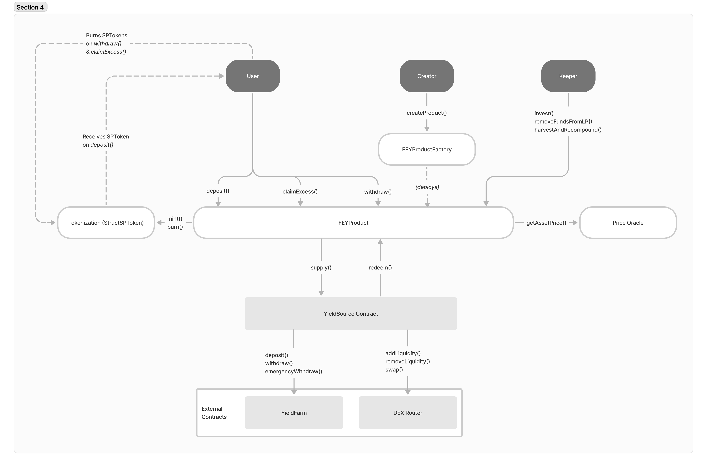

# Struct Protocol  •   [](https://coveralls.io/github/struct-defi/struct-core?branch=develop) [](https://book.getfoundry.sh/) [](https://opensource.org/licenses/MIT)


<br>

<picture>
  <source media="(prefers-color-scheme: dark)">
  
</picture>

## Table of Contents
- [What is Struct?](#what-is-struct)
- [Architecture](#architecture)
- [Blueprint](#blueprint)
- [Prerequisites](#prerequisites)
- [Setup & Testing](#setup--testing)
- [Deployment](#deployment)


## What is Struct?
Struct Finance is an innovative DeFi protocol bringing structured financial products to the world of decentralized finance. Our initial offering, Interest Rate Products, segments yield-bearing assets into distinct tranches, each with varying levels of risk.

Tranching is a method that alters the risk profile of investments by dictating the order in which the cash flows from these assets are disbursed to investors. Those who invest in the fixed tranche receive a prioritized return in the form of consistent cashflows. On the other hand, investors in the variable tranche have the chance to secure amplified returns through leveraged exposure to the performance of the underlying assets.

Furthermore, our factory contract allows for the creation of bespoke interest rate products, which can be tailored to fit specific parameters such as maturity, fixed-rate, platform, and so forth.

### High-level Overview of Tranching:
Initially, deposits are collected from two distinct groups of investors: those seeking predictable, fixed returns, and those craving leveraged exposure who are ready to accept the risk of variable returns. The period during which these deposits are collected from the investors is known as the subscription period. At the end of the subscription period, the collected capital is deployed into a yield-bearing position (e.g., DEX such as TraderJoe or GMX's GLP) to generate yield.

The yield accrual is set for a predefined time (for example, one month, two months, or three months), which is determined by the settings on the factory contract during the creation of the product. After the set period concludes and the product matures, the capital, along with all accrued rewards, is withdrawn from the liquidity pool. Fixed-tranche investors are then paid back their principal and fixed rate. The remaining amount is subsequently returned to the variable-tranche investors.

### Architecture



FEY: Fixed Enhanced Yield

#### FEYProductFactory:
The FEYProductFactory empowers users to customize FEYProduct contracts, fostering the development of fixed and enhanced yield product pairs. The Factory contract includes governance-only setter methods that whitelist assets and pools and updates configurations such as minimum initial deposit amount, tranche duration limits, and more. It's important to note that each integration will maintain a separate factory contract. For instance, the GMX integration utilizes a unique factory contract named FEYGMXProductFactory.sol. All assets and pools must be whitelisted before the creation of new products. The Factory contract employs OpenZeppelin’s Clones library to generate new products via the `createProduct()` method.

#### FEYProduct:
The FEYProduct contract enables the exchange of yield/risk between two investor groups, providing one with a fixed-rate product, and the other with a variable, potentially enhanced rate, accepting the risk of fluctuating yield and impermanent loss. This risk distribution is referred to as tranching in finance, with the senior tranche receiving the fixed-rate and the junior tranche, the variable rate.

A product may occupy one of three states: OPEN, INVESTED, and WITHDRAWN. These states determine the actions users can perform. The rationale for these states originates from the challenges in securing a fixed-rate product via liquidity pools on a DEX.

During the period which the product is OPEN for deposits and both sides of the pool are compiled, deposits are transferred to the FEYProduct contract but do not generate yield. Upon creation, a product's default state is OPEN. Users can only call the `deposit()` method and invest their funds in the OPEN state.

Transition from the OPEN state to the INVESTED state occurs once `invest()` is invoked. The `invest()` method can only be initiated when the timestamp exceeds the trancheStartTime set during product creation. Triggering `invest()` deposits the funds into the liquidity pool via the YieldSource contract to accumulate reward tokens and transaction fees. If the tranches are unbalanced, a swap equalizes them, potentially putting the junior tranche in a leveraged position. The leverageThresholdMax variable determines the extent of leverage the junior tranche can assume. Excess funds surpassing this threshold are returned to the users, who can claim them via the `claimExcess()` method. Users can also claim their excess after maturity in a single transaction by calling `claimExcessAndWithdraw()`.

The second challenge is addressed by setting a maturity date for the product, governed by the `trancheEndTime` variable. Once the block timestamp surpasses the `trancheEndTime`, the `removeFundsFromLP()` method can be invoked. This action extracts all funds and reward tokens from the underlying liquidity pool, levies any protocol fees, performs necessary swaps to ensure the fixed rate for the senior tranche, and shifts the state from INVESTED to WITHDRAWN.

When the product enters the WITHDRAWN state, users can withdraw their funds and accumulated returns by calling the `withdraw()` method.

#### GMX V1
* [GMX FEYProduct](https://github.com/struct-defi/struct-core/blob/develop/contracts/protocol/products/gmx/FEYGMXProduct.sol)
* [GMX FEYProductFactory](https://github.com/struct-defi/struct-core/blob/develop/contracts/protocol/products/gmx/FEYGMXProductFactory.sol)


#### GlobalAccessControl:
The GlobalAccessControl contract, which inherits OpenZeppelin’s AccessControl and Pausable contracts, serves as a central hub for all roles. It also facilitates pausing and unpausing the protocol on a global scale. Enforces the access control methods for the entire protocol implemented by the `GACManaged` contract which inherits the [GlobalAccessControl](https://github.com/struct-defi/struct-core/blob/develop/contracts/protocol/common/GlobalAccessControl.sol) for the roles. All the core contract will inherit the [GACManaged](https://github.com/struct-defi/struct-core/blob/develop/contracts/protocol/common/GACManaged.sol) contract.

| Role              | Privilege                                                                                                                                                                                                                                                                                                                                                                                                                                                                                                                                                                                                                             |
|-------------------|---------------------------------------------------------------------------------------------------------------------------------------------------------------------------------------------------------------------------------------------------------------------------------------------------------------------------------------------------------------------------------------------------------------------------------------------------------------------------------------------------------------------------------------------------------------------------------------------------------------------------------------|
| GOVERNANCE        | FEYFactory: Sets parameters including product, yield source, and<br> price oracle implementations, min and max tranche duration, protocol fees, leverage threshold min and max, fixed rate max, min deposit value, whitelist tokens and pairs.<br><br> FEYProduct: Sets slippage and rescues tokens in case they get stuck.<br><br> YieldSource: Distributes rewards via the Yield Source to incentivize Products.<br><br> SPToken: Sets the Factory implementation and the base token URI for all token IDs.<br><br> DistributionManager: Initializes contract, adds/removes/edits distribution recipients, sets rewards per second. |
| KEEPER            | Calls `recompoundRewards` on the YieldSource                                                                                                                                                                                                                                                                                                                                                                                                                                                                                                                                                                                          |
| PAUSER            | Pause/unpause the protocol globally                                                                                                                                                                                                                                                                                                                                                                                                                                                                                                                                                                                                   |
| PRODUCT           | Mints and burns SP Tokens, supplies tokens to and redeems tokens from YieldSource, queues fees on DistributionManager.                                                                                                                                                                                                                                                                                                                                                                                                                                                                                                                |
| FACTORY           | Calls `depositFor` on Product, calls `setFEYGMXProductInfo` on YieldSource.                                                                                                                                                                                                                                                                                                                                                                                                                                                                                                                                                           |
| WHITELIST_MANAGER | Grants WHITELISTED roles to accounts                                                                                                                                                                                                                                                                                                                                                                                                                                                                                                                                                                                                  |
| WHITELISTED       | Creates products without fulfilling minimum deposit requirement                                                                                                                                                                                                                                                                                                                                                                                                                                                                                                                                                                       |

#### YieldSource:
The YieldSource contract is where most external interactions take place, such as adding liquidity, removing liquidity, farming, etc. It's employed by the FEYProduct contracts to accumulate yield. Each integration (like TraderJoe, GMX, etc.) will have a separate yield source contract implementation. This design choice simplifies the process of adding new yield sources. For TraderJoeYieldSource, individual deployments will be made for each Liquidity Pool. When FEYProducts are created, they will be initialized with the YieldSource address based on the underlying pool. Each YieldSource will maintain a record of shares for every product that uses it as a yield source.

#### SPToken:
The SPToken is used to document the user's position. When users deposit funds into any of the FEYProducts, they receive SPTokens in a 1:1 ratio. These can be viewed as a proof of deposit for Struct Products. Each tranche has a unique tokenId, known as `spTokenId`, which is tracked in the Factory contract. Despite inheriting the ERC1155 contract, the SPToken does come with a restriction: SPTokens cannot be transferred when the state of the FEYProduct is OPEN. This restriction is implemented to prevent internal accounting issues and potential spoofing exploits. In essence, SPTokens are minted by the FEYProduct contract upon deposit, and they are burned during the `claimExcess()` and `withdraw()` processes.

#### DistributionManager:
The Distribution Manager is a contract designed to gather all protocol-earned fees and token distributions, subsequently distributing them as rewards to the relevant contracts. This contract draws inspiration from Synthetix’s [RewardsDistribution](https://github.com/Synthetixio/synthetix/blob/develop/contracts/RewardsDistribution.sol) contract.

Rewards can be categorized into two types:
1. Fees earned by the protocol
2. Token distribution (reserved for incentives)

The protocol-earned fees are collected in the native token of the chain (e.g., AVAX for Avalanche), while token distributions will be in the form of STRUCT tokens. The quantity of fees distributed as rewards is dependent on the revenue generated by the protocol. Conversely, token distribution is based on the rewardsPerSecond as determined by `GOVERNANCE`.

#### PriceOracle:
StructPriceOracle integrates Chainlink’s [AggregatorV3 interface](https://github.com/smartcontractkit/chainlink/blob/develop/contracts/src/v0.8/interfaces/AggregatorV3Interface.sol) to fetch prices on-chain. It allows us to add a price feed for multiple assets and retrieve prices from this single contract. All the prices returned have an 18 decimal value.

## Blueprint:

```
├─ contracts
|  ├─ external — "External protocol interfaces"
|  ├─ interfaces — "Struct protocol interfaces"
|  ├─ mocks — "Mock contracts used in the tests"
|  ├─ utils — "Basic Utility contracts"
|  ├─ protocol = "Core protocol contracts"
|      ├─ common — "Contracts shared by all other contracts in the protocol"
|      ├─ libraries — "Contains libraries for helpers methods, validations and datatypes"
|      ├─ misc — "Other general contracts"
|      ├─ products — "Contains FEYProduct and FEYProductFactory contracts"
|      ├─ tokenization — "StructSPToken implementation"
|      └─ yield-sources — "Contains the yield source contracts"
|           
├─ test  
    ├─ foundry - "Contains all the unit tests and integration tests using foundry"
``` 

## Prerequisites

### Foundry
You must install [Foundry](https://github.com/gakonst/foundry). Run the command below to get `foundryup`, the Foundry toolchain installer:

```
curl -L https://foundry.paradigm.xyz | bash
```

If you do not want to use the redirect, feel free to manually download the foundryup installation script from [here](https://github.com/gakonst/foundry).

Then in a new terminal session or after reloading your PATH, run it to get the latest forge version:

```
foundryup
```

Finally, install libraries:

```
forge install
```

### Environment Variables
Fill in the `.env` file with these variables:

`MAINNET_RPC`: The RPC URL endpoint of the Avalanche C-Chain network.
`PRIVATE_KEY`: The private key of the EVM account you are deploying from.
`SNOWTRACE_API_KEY`: The API key required to verify the source code for Solidity contracts on Snowtrace


## Setup & Testing:

To conduct test or deploy contracts you must create an environment file named `.env` and fill the environment variables.

```
cp .env.example .env
```

For the RPC endpoint you can choose your preferred one (do not forget to update the `.env` file accordingly).
`PRIVATE_KEY` is only required to deploy contracts.

### Testing:

Unit Tests are run locally and the fork tests are run against a fork of the Avalanche C-Chain mainnet, which allows us to interact directly with protocols.

To run tests on different platforms, navigate a Unix terminal to the root folder of the project and run the command of your choice.

To run foundry unit tests:

```
npm run forge:unit-tests
```

To run foundry fork tests:

```
npm run forge:fork-tests
```


## Deployment:
Configure the contracts to deploy by adding or removing the values for the following variables in `deployment-helpers/Addresses.sol`:
* `STRUCT_PRICE_ORACLE`
* `STRUCT_DISTRIBUTION_MANAGER`

To deploy the entire GMX contract suite to AVAX C-Chain:
`npm run deploy:avax-cchain:gmx`

## Questions & Feedback

Please direct any questions or feedback to [development@struct.fi](mailto:development@struct.fi).
